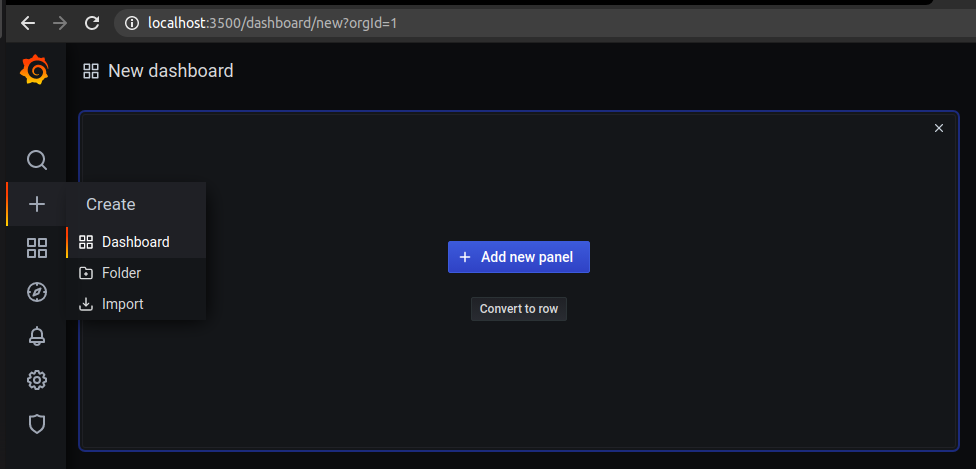

# Práctica docker-compose

## ¿Que es DOCKER?

_La idea detrás de Docker es crear contenedores ligeros y portables para las aplicaciones software que puedan ejecutarse en cualquier máquina con Docker instalado, independientemente del sistema operativo que la máquina tenga por debajo, facilitando así también los despliegues._

**¿Qué es un contenedor?**

_Imagina un contenedor de carga cualquiera, que lleva dentro algo que puedes llevarte a cualquier lado. Es algo auto contenido en sí, que se puede llevar de un lado a otro de forma independiente, es portable._

**Beneficios**
En el caso de los desarrolladores, el uso de Docker hace que puedan centrarse en desarrollar su código sin preocuparse de si dicho código funcionará en la máquina en la que se ejecutará.
 
## ¿Que es DOCKER-COMPOSE?
_Docker Compose es una herramienta que permite simplificar el uso de Docker. A partir de archivos YAML es mas sencillo crear contendores, conectarlos, habilitar puertos, volumenes, etc. Está hecho pensando en que no todas las aplicaciones son tan sencillas como para utilizar solamente un dockerfile, docker-compose trae la solución a ese problema_

## Objetivo de la práctica

En esta practica aprenderemos a monitorizar los endpoints de nuestra aplicación, para así tener un control mas claro de los procesos que realizan los usuarios en
nuestra web. Para ello utilizaremos grafana y prometheus, que veremos más adelante.

## Servidor

_Vamos a realizar la instalación de un servidor para nuestra aplicación, para ellos utilizaremos el servicio express partiendo de una imagen de node alpine_

Primero configuraremos nuestro Dockerfile de la siguiente manera:


Metemos los archivos necesarios para la aplicación en una carpeta llamada src


Hacemos el build para comprobar que está todo correcto

```
sudo docker build -t express_app .
```


Comprobamos que funciona correctamente para evitar futuros problemas

```
sudo docker run -p 6600:3000 --name contenedor_node_prueba express_app
```

Accedemos al puerto 6600 para comprobar que funciona correctamente:

```
localhost:6600
```


Nuestro docker-compose quedaria de la siguiente manera por el momento:


## Prometheus

### ¿Que es?

_Prometheus es un sistema de monitorización y de alerta, que cumple una serie de objetivos_

- Consultar y almacenar la series de datos.
- Un Pushgateway para permitir que los trabajos efímeros y por lotes expongan sus métricas a Prometheus.
- Exporters útil para casos donde no es factible instrumentar un sistema dado con métricas Prometheus directamente.
- Un sistema de manejo de alarmado.
- Un sistema de discovery.

Para empezar, creamos una carpeta llamada “prometheus” y metemos los archivos necesarios dentro:


Configuramos nuestro docker-compose de la siguiente manera


Ejecutamos nuestro docker-compose para comprobar que está todo correcto
```
sudo docker-compose up
```
Verificamos que funciona correctamente accediendo al puerto:

- localhost:9090


## Grafana

### ¿Que es?

_Grafana es una herramienta para visualizar datos de serie temporales._

_A partir de una serie de datos recolectados obtendremos un panorama gráfico de la situación de una empresa u organización como veremos a continuación_

Creamos una carpeta llamada “grafana” y metemos dentro los archivos necesarios:


Configuramos nuestro docker-compose de la siguiente manera:


Ejecutamos nuestro docker-compose para comprobar que funciona correctamente

- sudo docker-compose up

Accedemos al puerto donde se ejecuta nuestra aplicación para verificar que sigue funcionando correctamente

- localhost:83


Accedemos al puerto donde se ejecuta _prometheus_ para verificar que sigue funcionando correctamente

- localhost:9090/targets


Comprobamos que _grafana_ se ejecuta correctamente accediendo al puerto

- localhost:3500


En el menu de la parte izquierda, nos dirigimos al icono “+” y seleccionamos Dashboard, seguidamente hacemos click en “Add new panel”



En la parte de las querys, seleccionamos “counterHomeEndpoint” para el primero


Añadimos una nueva haciendo click en “+ Query”


Y seleccionamos la opcion de “CounterMessageEndpoint”, y nos quedaria de la siguiente manera:


Aplicamos los cambios realizados haciendo click arriba a la derecha en “Apply”:


Después, creamos un nuevo panel repitiendo el proceso anterior, y en metrics ponemos lo siguiente:

- sum(counterHomeEndpoint+counterMessageEndpoint)

Para llevar el recuento de los dos endpoints. Quedaria de la siguiente manera:


En el apartado de visualización seleccionamos la opción Stat


Le damos a “Apply” nuevamente y quedaria de la siguiente forma:


Y guardamos el dashboard


Ahora podemos hacer unas cuentas visitas a:
- localhost:83

&&

- localhost:83/messages

Y comprobamos que funciona correctamente

